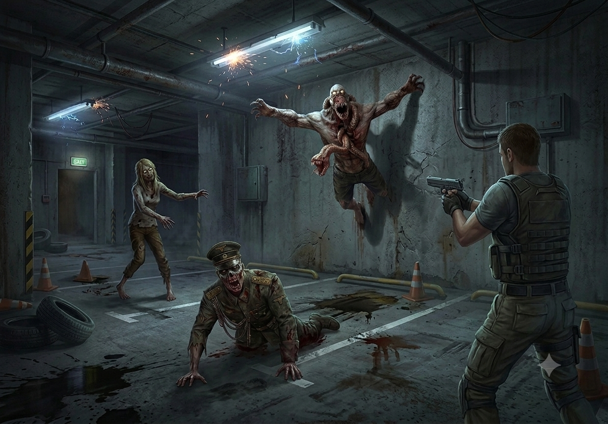

# 🧟 Project Predator 💀

## Modular AI & Gameplay Systems Framework

Project Predator is a long-term Unity project built around one goal: **experimenting with intelligent, unpredictable, and highly modular creature behavior.**

Instead of building a single enemy controller filled with hardcoded logic, Predator is structured as a collection of reusable gameplay frameworks covering **AI decision making, perception, traversal, combat, animation, physics, procedural systems, and debugging tools**.

The project started as an experiment with Game AI and gradually evolved into a modular creature framework where different enemy archetypes can be assembled from reusable systems.

---

## 🎥 Demo

### Project Predator V1

https://www.youtube.com/watch?v=PJ8d_m_bnw0

---

## 🎮 Download & Play

Download the playable **Project Predator V1** build from Google Drive:

https://drive.google.com/drive/u/1/folders/1BS_NBWpGS2G97H8uzPcTpNy1vhEFUFgT

## 🌐 Portfolio

Full project breakdown, technical details, screenshots, and development information:

https://kaushal-portfolio-liart.vercel.app/Projects/ProjectPredator

---

# Project Information

| | |
|---|---|
| **Role** | Solo Developer |
| **Engine** | Unity |
| **Language** | C# |
| **Tools** | Unity, Blender |
| **Platform** | PC |
| **Version** | V1 |
| **Development Time** | 6 Months |
| **Development Period** | January 2026 – June 2026 |
| **Status** | Stable & In Active Development |

---

# Why I Made It

I wanted to understand how far I could push enemy intelligence beyond the traditional:

~~~
See Player → Chase Player → Attack Player
~~~

behavior.

Games like **Outlast, Dead Space, SOMA, Prey, Half-Life, GTA, and Saints Row** made me curious about how game characters perceive their surroundings, make decisions, navigate environments, and react to the player.

I wanted to answer questions such as:

- How does an AI know where the player is?
- What happens when it loses visual contact?
- Can it investigate sounds without seeing the player?
- Can darkness affect what an enemy can perceive?
- How can an AI decide between multiple possible actions?
- How can creatures move across walls and ceilings?
- How can multiple creatures avoid each other?
- How can different enemies share the same underlying systems while behaving differently?

Project Predator became my sandbox for answering those questions through actual implementation.

---

# The Interesting Part

Predator is not simply a zombie AI.

It is a collection of **independent gameplay frameworks** that can be combined to create different creature behaviors.

The project currently explores:

- Finite State Machines
- Goal-Oriented Action Planning experimentation
- Vision
- Hearing
- Proximity sensing
- Field-of-view detection
- Darkness awareness
- Surface traversal
- Wall traversal
- Ceiling traversal
- Ledge traversal
- Custom movement
- Local avoidance
- Modular combat
- Modular weapons
- Procedural dismemberment
- Animation-compatible ragdolls
- Recoil
- Bullet trails
- Runtime mesh manipulation
- Wave-based gameplay
- Runtime debugging and visualization

The underlying idea is **composition over hardcoded enemy implementations**.

A creature can be assembled from different capabilities rather than requiring a completely separate AI implementation.

---

# Core Systems

## 🧠 Finite State Machine

The creature AI uses a modular Finite State Machine to coordinate high-level behavior.

Individual states are responsible for specific behaviors while the FSM manages transitions between them.

A simplified behavior flow can look like:

~~~
Idle
  ↓
Investigate
  ↓
Chase
  ↓
Attack
  ↓
Search
  ↓
Return
~~~

The architecture keeps individual behaviors isolated instead of placing the entire decision-making process inside one large controller.

The project also includes experimentation with **Goal-Oriented Action Planning (GOAP)** as a potential approach for more complex decision-making.

---

# 👁️ AI Perception Framework

The perception system is designed as a reusable framework rather than a collection of checks embedded directly inside the enemy AI.

It combines multiple sources of information:

- Vision
- Hearing
- Proximity
- Field of view
- Visibility
- Darkness
- Environmental conditions

This allows the creature to build a more useful understanding of its surroundings.

### Vision

Vision checks more than simply asking whether the player is nearby.

The system can reason about factors such as:

- Distance
- Field of view
- Line of sight
- Visibility
- Environmental lighting

### Hearing

Sound events can become perception inputs.

A creature can therefore investigate a sound even when the player is not directly visible.

### Darkness Awareness

Darkness is treated as part of perception rather than purely a visual effect.

This allows environmental lighting to influence whether the creature can detect a target.

---

# 🕷️ Surface Traversal Framework

One of the most technically challenging systems in Predator is the custom surface traversal framework.

The creatures are not restricted to conventional ground-based navigation.

The framework allows them to reason about surfaces and transition between different orientations.

Creatures can traverse:

- Floors
- Walls
- Ceilings
- Ledges
- Uneven surfaces
- Arbitrary geometry

The traversal system handles the transition between surfaces while maintaining appropriate movement and orientation.

### Why not simply use NavMesh?

The traversal framework was intentionally designed to operate independently of Unity's NavMesh.

This allows creatures to move through environments where conventional ground-based navigation would not be sufficient.

The system instead works with detected surfaces and traversal information to determine how the creature should move and orient itself.

---

# 🧭 Movement & Local Avoidance

Predator also contains custom movement and avoidance behavior for environments containing multiple creatures.

The system explores:

- Local avoidance
- Collision prevention
- Movement around obstacles
- Multi-agent movement
- Navigation across complex geometry

The goal is to prevent creatures from simply walking directly into each other or producing unnatural group movement.

---

# ⚔️ Modular Combat Framework

Combat is separated from the creature's core AI.

Instead of hardcoding every attack directly into the enemy controller, combat capabilities can be implemented as independent systems.

This allows different creatures to have different attack capabilities while sharing the same underlying AI architecture.

The framework supports experimentation with:

- Melee attacks
- Ranged attacks
- Attack behaviors
- Hit detection
- Damage
- Recoil
- Weapon behavior

This separation also makes it possible to expand creature behavior without rewriting the AI itself.

---

# 🔫 Modular Weapon Framework

Predator contains a reusable weapon framework designed around configurable weapon behavior.

The framework includes systems for:

- Weapon runtime instances
- Fire mode execution
- Hit detection
- Bullet trails
- Recoil
- Weapon configuration

Weapon behavior is separated from the creature's main gameplay logic so different weapons can be introduced without modifying the core AI architecture.

---

# 🩸 Procedural Dismemberment Framework

The dismemberment system allows body parts to be removed dynamically during gameplay.

The difficult part was not simply removing a mesh.

The system had to coexist with:

- Animation
- Ragdolls
- Physics
- Runtime mesh manipulation
- Damage
- Gameplay state

The framework therefore treats dismemberment as a gameplay system rather than purely a visual effect.

The goal is to preserve gameplay continuity even after the character's structure has been modified at runtime.

---

# 🦴 Animation-Compatible Ragdolls

Predator includes a custom animation/ragdoll workflow allowing creatures to transition between animation-driven and physics-driven states.

This allows characters to:

- Enter ragdoll states
- React to physical impacts
- Recover from physics
- Return to animation
- Continue gameplay after recovery

The ragdoll system was developed alongside the combat and dismemberment systems so the different systems could operate together.

---

# 🔫 Shooting & Weapon Systems

The weapon framework also contains reusable systems for shooting and weapon execution.

Some of the systems explored include:

- Runtime weapon instances
- Fire mode execution
- Hit detection
- Bullet trails
- Recoil
- ScriptableObject-based weapon configuration

The objective was to keep weapon behavior modular enough that gameplay systems do not need to know the implementation details of every individual weapon.

---

# 🧪 Debugging & Visualization

A major part of developing Predator was building tools that made the AI's internal behavior visible.

Debugging and visualization systems were created for areas such as:

- Vision rays
- Perception
- Traversal vertices
- Surface detection
- Navigation paths
- State transitions
- AI decision making

This was particularly important when working on traversal and perception.

Instead of trying to understand why an AI was behaving incorrectly purely from the final result, the internal information could be visualized directly during runtime.

---

# 🧟 Wave Gameplay

V1 also contains a simple gameplay layer used to test the AI and combat systems in an actual gameplay loop.

The wave system handles:

- Enemy spawning
- Spawn points
- Enemy respawning
- Wave progression
- Kill tracking
- Remaining enemy count
- Current wave
- Enemy variants

This provides a practical environment for testing the underlying frameworks together rather than testing each system in isolation.

---

# Technical Challenges

### 1. Custom Surface Traversal

Built a custom traversal framework capable of reasoning about arbitrary geometry and transitioning between different surface orientations without relying on Unity's NavMesh.

### 2. Multi-Layer AI Perception

Combined vision, hearing, darkness awareness, field-of-view detection, and proximity sensing into a reusable perception architecture.

### 3. Modular Combat

Separated combat behavior from the creature's core AI so different creatures can use different attack capabilities without rewriting their underlying architecture.

### 4. Procedural Dismemberment

Developed runtime dismemberment capable of interacting with animation, ragdolls, physics, damage, and gameplay systems.

### 5. Scalable AI Architecture

Built the creature framework around reusable states and independent systems instead of one monolithic enemy controller.

### 6. Surface Orientation

Created systems for transitioning between floors, walls, ceilings, and other surfaces while maintaining appropriate creature orientation and movement.

### 7. Multi-Agent Avoidance

Implemented custom avoidance and movement behavior to reduce collisions and unnatural movement between multiple creatures.

### 8. Runtime Debugging

Built visualization tools for inspecting perception, traversal, navigation, and state transitions during development.

### 9. Reusable Creature Architecture

Designed the core frameworks so different enemy archetypes can share perception, combat, movement, and decision-making systems while still behaving differently.

### 10. Mathematics & Physics

Experimented with mathematical and physics-based approaches for traversal, orientation, movement, perception, and procedural behavior before arriving at reliable implementations.

---

# Architecture Decisions

| Decision | Reason |
|---|---|
| **Framework Composition** | Creature behaviors are assembled by combining independent gameplay frameworks rather than creating hardcoded enemy implementations. |
| **Separation of Concerns** | Traversal, perception, combat, animation, dismemberment, and state management are isolated into dedicated systems. |
| **State Coordination** | The FSM coordinates high-level behavior while individual states remain focused on specific responsibilities. |
| **Data-Driven Behavior** | Creature capabilities can be configured through reusable components, allowing enemy variants to be assembled with minimal code changes. |
| **Composition over Inheritance** | Gameplay functionality is composed from modular components instead of relying on deep inheritance hierarchies. |
| **Traversal Independence** | Traversal was intentionally designed without relying on Unity's NavMesh, allowing creatures to operate across arbitrary surfaces. |
| **Debugging First** | Major systems expose visualization and runtime debugging information to make complex behavior easier to inspect. |
| **Reusable AI Frameworks** | Perception, combat, movement, and decision-making systems are designed to be reused across different creatures. |
| **Scalable Creature Pipeline** | New creatures, weapons, behaviors, and traversal capabilities can be added without redesigning the entire framework. |

---

# Architecture Overview

The overall framework can be thought of as a collection of independent systems working together:

~~~
                         Creature
                            |
          +-----------------+-----------------+
          |                 |                 |
     Perception          Combat          Traversal
          |                 |                 |
          +-----------------+-----------------+
                            |
                           FSM
                            |
                    Creature Behavior
                            |
                    Gameplay Systems
~~~

This architecture allows a creature to be composed from capabilities rather than being defined entirely by one large class.

For example, two creatures could share the same perception and traversal systems while using completely different combat behavior and state logic.

---

# Development Philosophy

The main objective of Predator was not simply to make **one enemy work**.

It was to build systems that could make **many different enemies work**.

Instead of:

~~~
Enemy A
Enemy B
Enemy C
Enemy D
~~~

with each enemy containing duplicated implementations, the framework aims for:

~~~
Reusable Perception
Reusable Combat
Reusable Traversal
Reusable Movement
Reusable Weapon Systems
Reusable Decision Making
           ↓
      Creature Archetype
~~~

This makes the project easier to extend and gives future creatures access to systems that have already been developed and tested.

---

# Technologies

- Unity
- C#
- Blender
- Unity Animator
- Unity Physics
- Finite State Machines
- GOAP experimentation
- ScriptableObjects
- Procedural Runtime Systems
- Custom AI Systems

---

# Project Status

**V1 — Stable & In Active Development**

V1 represents the first stable iteration of the framework.

The project is still intended to evolve, with future development focused on expanding:

- Creature behaviors
- AI decision making
- Perception
- Traversal
- Combat
- Enemy variants
- Procedural gameplay
- Reusable gameplay frameworks

---

# Repository Contents

This repository contains the C# scripts and programming systems developed for Project Predator.

The complete Unity project is not included because the project contains a large number of assets including:

- 3D models
- Animations
- VFX
- Audio
- Textures
- Builds
- Other project files

The repository is primarily intended to showcase the **AI architecture, gameplay programming, and technical systems** behind Project Predator.

---

# Links

### 🌐 Portfolio

https://kaushal-portfolio-liart.vercel.app/Projects/ProjectPredator

### 🎥 Project Predator V1

https://www.youtube.com/watch?v=PJ8d_m_bnw0

## 🎮 Download & Play

Download the playable **Project Predator V1** build from Google Drive:

https://drive.google.com/drive/u/1/folders/1BS_NBWpGS2G97H8uzPcTpNy1vhEFUFgT
